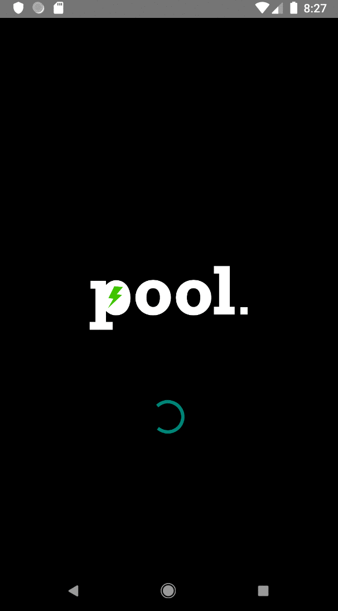

## POOL Mobile App (In development)
#### Created Raymond Gitonga

### Descriotion
An application that allows users to shop from different shops at the same time

### Technologies Used

### Getting Started
In order for you to be able to run the application you must fulfill the following requirements:

Android phone/emulator must be at least at SDK level 22 in order to run the application. 
Have android studio installed. If you wish to clone this application to make changes then you can 
click on this link https://github.com/raymondleta/PoolAndroid and fork the repository.

### Screenshots

 

### Contact details
You can contact me throug my email raytosh95@gmail.com

### License
MIT 2019 Raymond Gitonga

