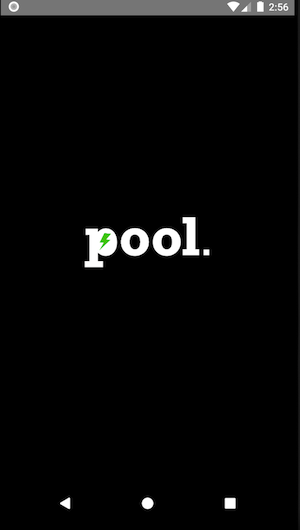
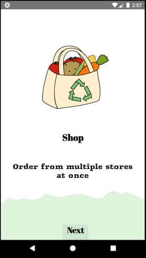
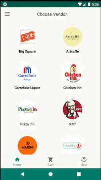
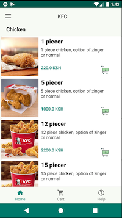

## POOL Mobile App (In development)
#### Created Raymond Gitonga

### Descriotion
An application that allows users to shop from different shops at the same time

### Technologies Used

### Screenshots

 Splash screen                 |  Onboarding screen               |  Onboarding screen
:-----------------------------:|:--------------------------------:|:--------------------------------:
      |  | 
 Onbording screen              |  Main Screen                     |  Product Screen
      |  |  

### Contact details
You can contact me through my email raytosh95@gmail.com

### License
MIT 2019 Raymond Gitonga

