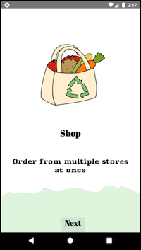
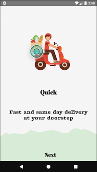
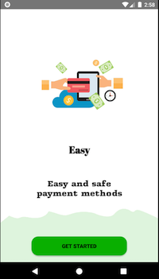

## POOL Mobile App (In development)
#### Created by Raymond Gitonga

### Descriotion
An application that allows users to shop from different shops at the same time

### Technologies Used

### Screenshots

 Splash screen                 |  Onboarding screen               |  Onboarding screen
:-----------------------------:|:--------------------------------:|:--------------------------------:
      |  | 
 Onbording screen              |  Login Screen                    |  Registration Screen
      |  |  
 Main screen                   |  Products screen                 | Navigation drawer
      |  | 
 Extras screen                 | 
      |
 
 
### Features
- :white_check_mark: Kotlin
- :white_check_mark: Live data
- :white_check_mark: Navigation
- :white_check_mark: ViewModel
- :white_check_mark: Rest with retrofit
- :white_check_mark: Offline Persistence with Room

### Todo

- [x] Extras dialog
- [ ] Forgot password
- [ ] Cart Layout
- [ ] Checkout
- [ ] Add data for other stores

### Contact details
You can contact me through my email raytosh95@gmail.com

### License
MIT 2019 Raymond Gitonga

